# 已成功识别的 Bbox 样本画廊

统计自 `.data/linebase.db`，共 **13** 行被 pipeline 标记为 `ok` 且通过 `verify` + `sanity` 双检。

每行三联图：**线稿 Logo** / **原图 + bbox 红框** / **裁剪结果**。

---

## 申请号 `71538886`

- **Job**: `c08c46f3646149ad`
- **Model**: `gpt-5.5`  (verify-loop: ON, prompt v_?)
- **Confidence**: `0.88`
- **bbox**: `[189, 5, 505, 430]`
- **Reason**: a tall rectangular cuboid package with visible top and side faces and a horizontal divider line across the front and side, matching the shape in Image 1
- **Quality**: clarity=0.9, completeness=0.95, isolation=0.95
- **Verify-pass reason**: The crop shows the full rectangular box outline with the central horizontal band and perspective side/top edges matching the registered mark.

| 线稿 Logo | 原图 + bbox | 裁剪结果 |
| --- | --- | --- |
| 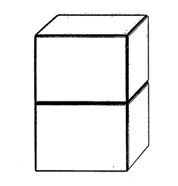 | 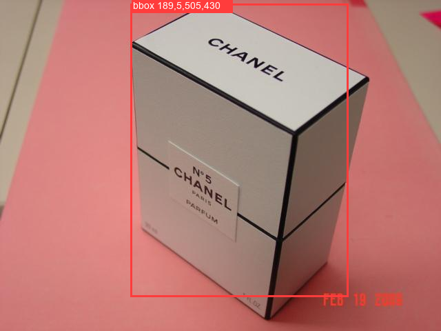 | 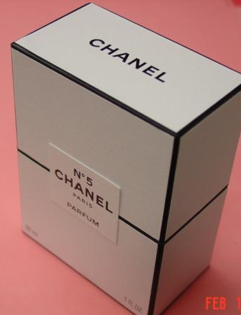 |

---

## 申请号 `74677567`

- **Job**: `2a2e801827dc457b`
- **Model**: `gpt-5.5`  (verify-loop: ON, prompt v_?)
- **Confidence**: `0.97`
- **bbox**: `[410, 755, 575, 1145]`
- **Reason**: a single leaning human figure dribbling a basketball, matching the silhouette in Image 1
- **Quality**: clarity=0.95, completeness=0.95, isolation=0.8
- **Verify-pass reason**: The full dribbling basketball player silhouette appears within the NBA branding, with surrounding product area included.

| 线稿 Logo | 原图 + bbox | 裁剪结果 |
| --- | --- | --- |
| 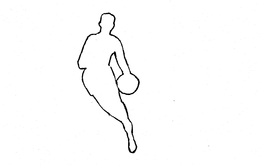 | 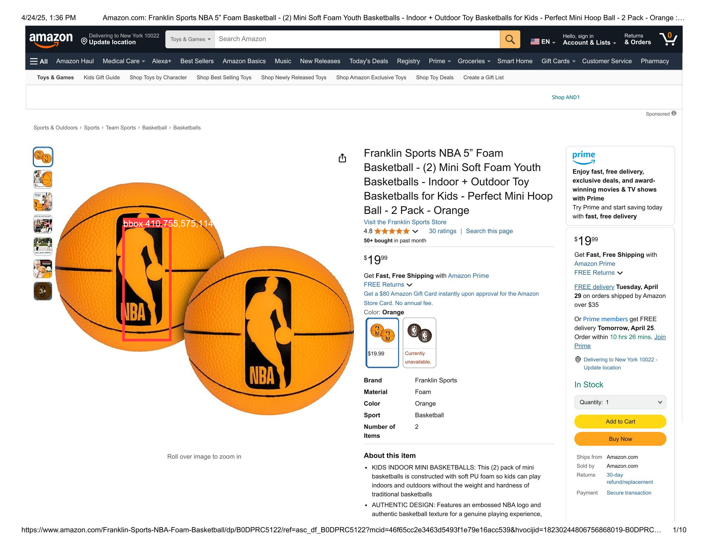 | 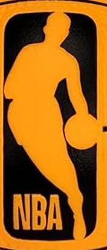 |

---

## 申请号 `75537343`

- **Job**: `2a2e801827dc457b`
- **Model**: `gpt-5.5`  (verify-loop: ON, prompt v_?)
- **Confidence**: `0.92`
- **bbox**: `[667, 158, 795, 466]`
- **Reason**: a single white human figure dribbling a basketball, matching the silhouette in Image 1
- **Quality**: clarity=0.9, completeness=0.95, isolation=0.6
- **Verify-pass reason**: The full basketball-player silhouette with ball matching the registered mark is visible, but the crop includes extra surrounding area to the right.

| 线稿 Logo | 原图 + bbox | 裁剪结果 |
| --- | --- | --- |
| 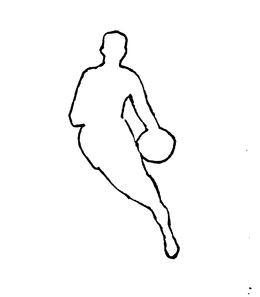 | 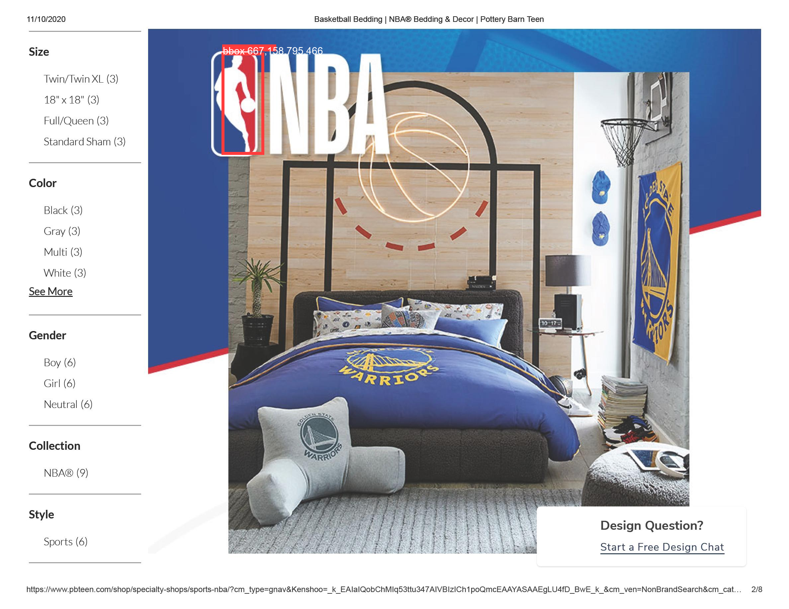 | 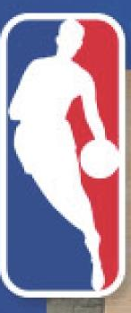 |

---

## 申请号 `75537827`

- **Job**: `2a2e801827dc457b`
- **Model**: `gpt-5.5`  (verify-loop: ON, prompt v_?)
- **Confidence**: `0.86`
- **bbox**: `[106, 274, 128, 318]`
- **Reason**: The NBA player silhouette mark appears clearly as branding in the NBA Store header.
- **Quality**: clarity=0.9, completeness=0.95, isolation=0.6

| 线稿 Logo | 原图 + bbox | 裁剪结果 |
| --- | --- | --- |
| 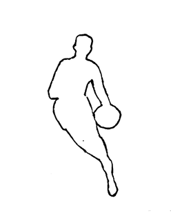 | 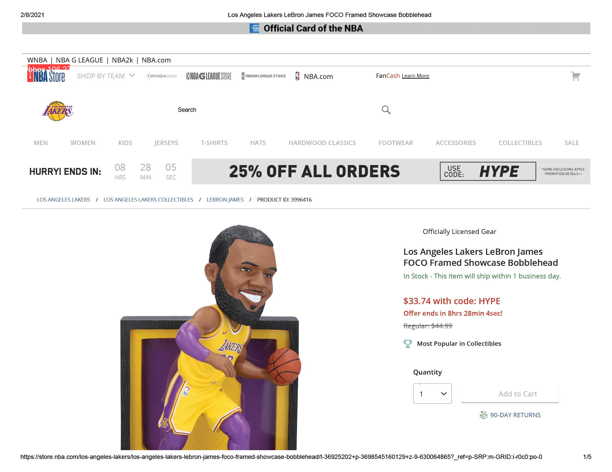 |  |

---

## 申请号 `76539417`

- **Job**: `d86f61ea499c446c`
- **Model**: `gpt-5.5`  (verify-loop: off, prompt v_?)
- **Confidence**: `0.97`
- **bbox**: `[611, 677, 846, 825]`
- **Reason**: The shirt chest print matches the registered Read to Achieve logo as a whole.
- **Quality**: clarity=0.89, completeness=1.0, isolation=0.93

| 线稿 Logo | 原图 + bbox | 裁剪结果 |
| --- | --- | --- |
|  | 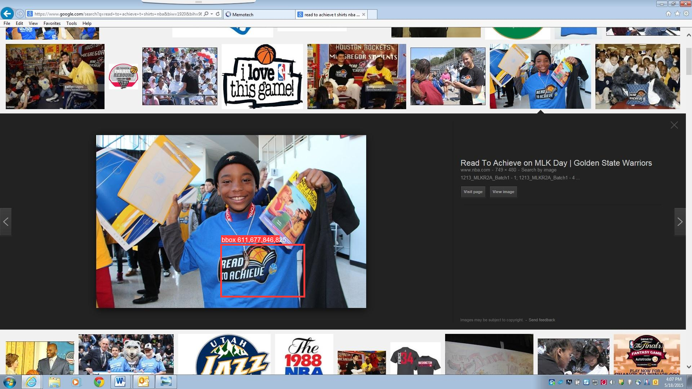 | 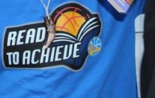 |

---

## 申请号 `77354840`

- **Job**: `61d4f7739be2480e`
- **Model**: `doubao-seed-2-0-pro-260215`  (verify-loop: ON, prompt v_?)
- **Confidence**: `0.98`
- **bbox**: `[140, 60, 890, 965]`
- **Reason**: A five-pointed star with left half blue and right half red, containing a white silhouette of a person dribbling a ball, matching the outline and feature arrangement of Image 1
- **Quality**: clarity=0.95, completeness=1.0, isolation=0.8
- **Verify-pass reason**: The full registered red-blue split star with white dribbling basketball player logo is entirely present, with extra silver decorative embroidery and background surrounding it.

| 线稿 Logo | 原图 + bbox | 裁剪结果 |
| --- | --- | --- |
| 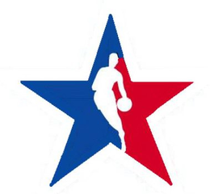 | 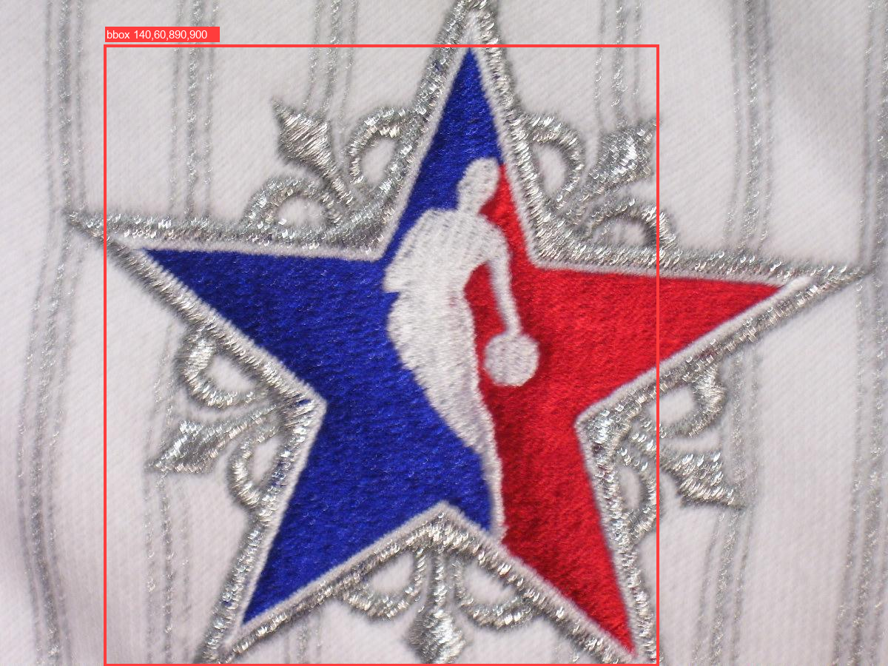 | 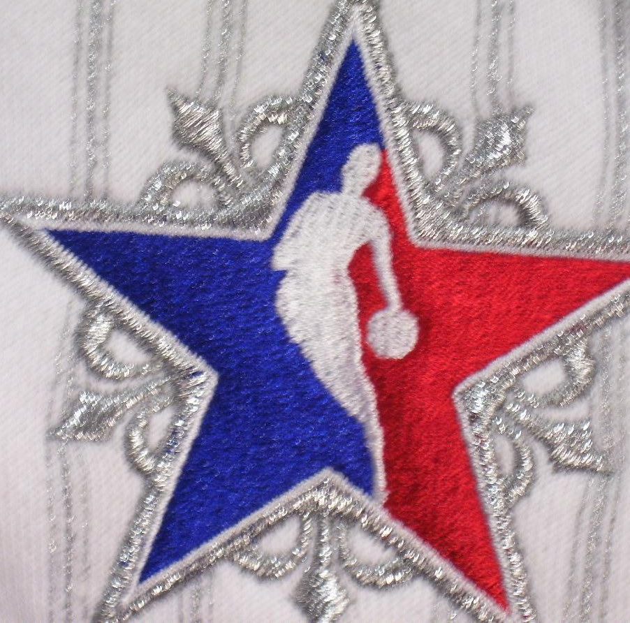 |

---

## 申请号 `78402390`

- **Job**: `d86f61ea499c446c`
- **Model**: `gpt-5.5`  (verify-loop: off, prompt v_?)
- **Confidence**: `0.98`
- **bbox**: `[544, 264, 674, 407]`
- **Reason**: The full trophy logo is clearly visible as a standalone branding graphic on the right.
- **Quality**: clarity=0.99, completeness=1.0, isolation=0.85

| 线稿 Logo | 原图 + bbox | 裁剪结果 |
| --- | --- | --- |
|  | 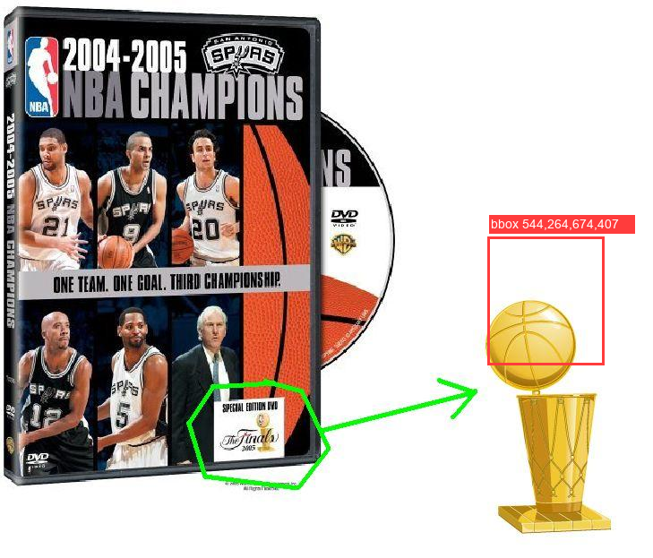 |  |

---

## 申请号 `78402403`

- **Job**: `d86f61ea499c446c`
- **Model**: `gpt-5.5`  (verify-loop: off, prompt v_?)
- **Confidence**: `0.88`
- **bbox**: `[199, 430, 281, 508]`
- **Reason**: Small NBA Finals trophy logo appears on the magazine cover as branded artwork.
- **Quality**: clarity=0.62, completeness=0.93, isolation=0.55

| 线稿 Logo | 原图 + bbox | 裁剪结果 |
| --- | --- | --- |
| 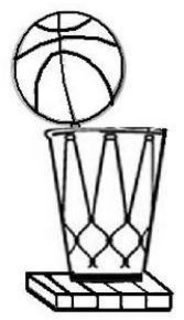 | 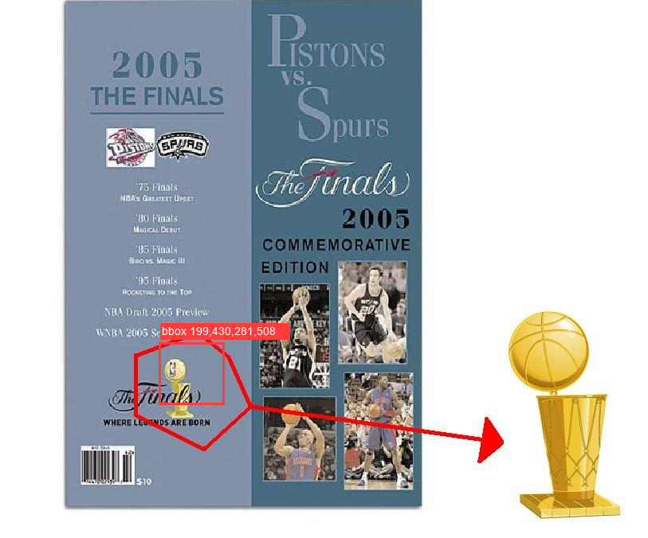 | 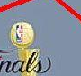 |

---

## 申请号 `78402423`

- **Job**: `2a2e801827dc457b`
- **Model**: `gpt-5.5`  (verify-loop: ON, prompt v_?)
- **Confidence**: `0.91`
- **bbox**: `[620, 390, 772, 687]`
- **Reason**: The registered basketball-and-hoop logo is clearly printed on the T-shirt as the main chest graphic.
- **Quality**: clarity=0.78, completeness=1.0, isolation=0.86

| 线稿 Logo | 原图 + bbox | 裁剪结果 |
| --- | --- | --- |
|  | 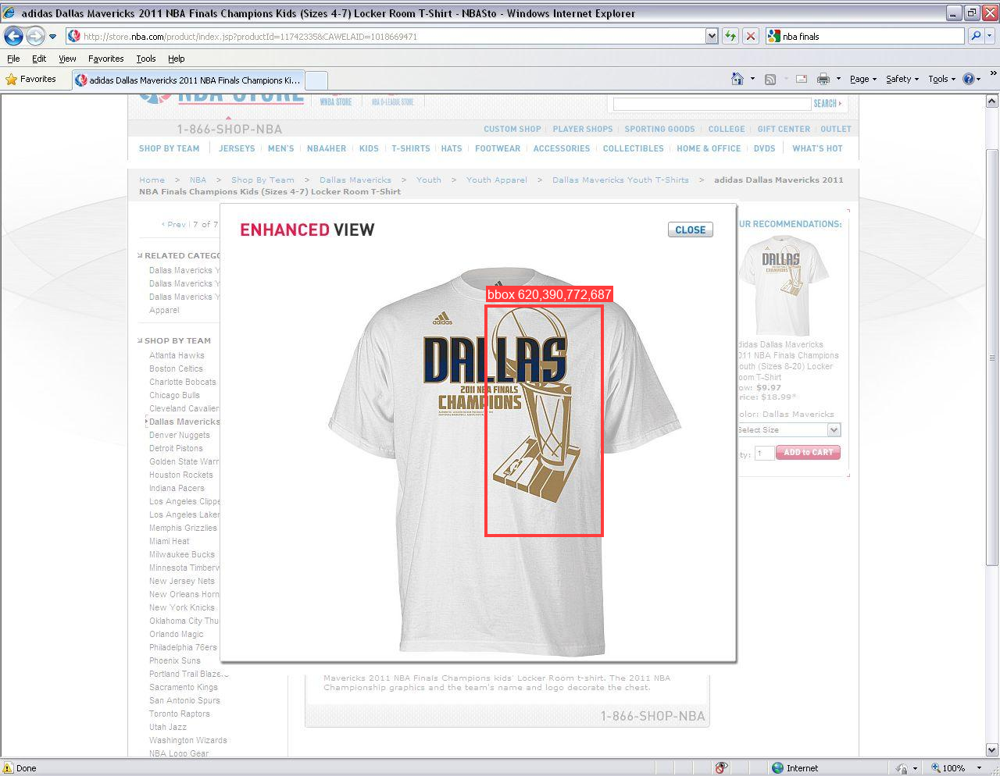 | 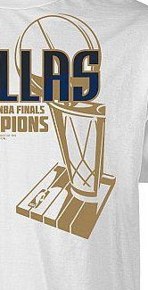 |

---

## 申请号 `79048263`

- **Job**: `c08c46f3646149ad`
- **Model**: `gpt-5.5`  (verify-loop: ON, prompt v_?)
- **Confidence**: `0.96`
- **bbox**: `[424, 514, 653, 734]`
- **Reason**: a five-petal radial flower-like mark with oval ends connected by tapered spokes to a central point
- **Quality**: clarity=0.9, completeness=0.98, isolation=0.8
- **Verify-pass reason**: The full five-petal Wacom flower mark is visible, but the crop includes substantial extra space and the wordmark below.

| 线稿 Logo | 原图 + bbox | 裁剪结果 |
| --- | --- | --- |
| 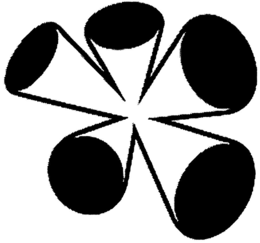 | 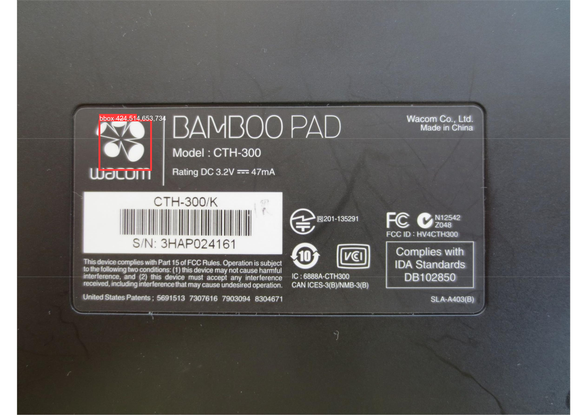 | 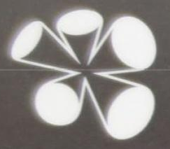 |

---

## 申请号 `85094272`

- **Job**: `c08c46f3646149ad`
- **Model**: `gpt-5.5`  (verify-loop: ON, prompt v_?)
- **Confidence**: `0.84`
- **bbox**: `[329, 381, 377, 473]`
- **Reason**: a mounted polo player holding a raised mallet, matching the horse-and-rider silhouette in Image 1
- **Quality**: clarity=0.58, completeness=0.78, isolation=0.82
- **Verify-pass reason**: The full polo rider on horse with mallet is visible, though low contrast, and is not clipped.

| 线稿 Logo | 原图 + bbox | 裁剪结果 |
| --- | --- | --- |
| 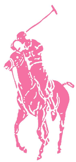 | 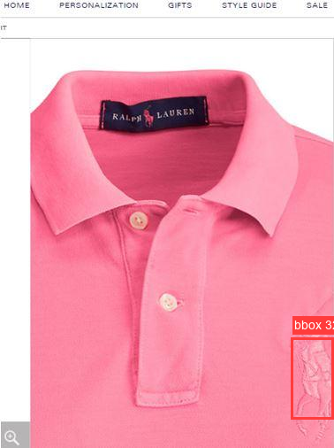 | 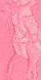 |

---

## 申请号 `87135634`

- **Job**: `d86f61ea499c446c`
- **Model**: `gpt-5.5`  (verify-loop: off, prompt v_?)
- **Confidence**: `0.83`
- **bbox**: `[79, 742, 1460, 1600]`
- **Reason**: The gold embossed logo appears on the product as the primary branding mark.
- **Quality**: clarity=0.58, completeness=0.88, isolation=0.97

| 线稿 Logo | 原图 + bbox | 裁剪结果 |
| --- | --- | --- |
| 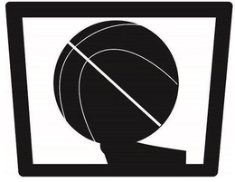 | 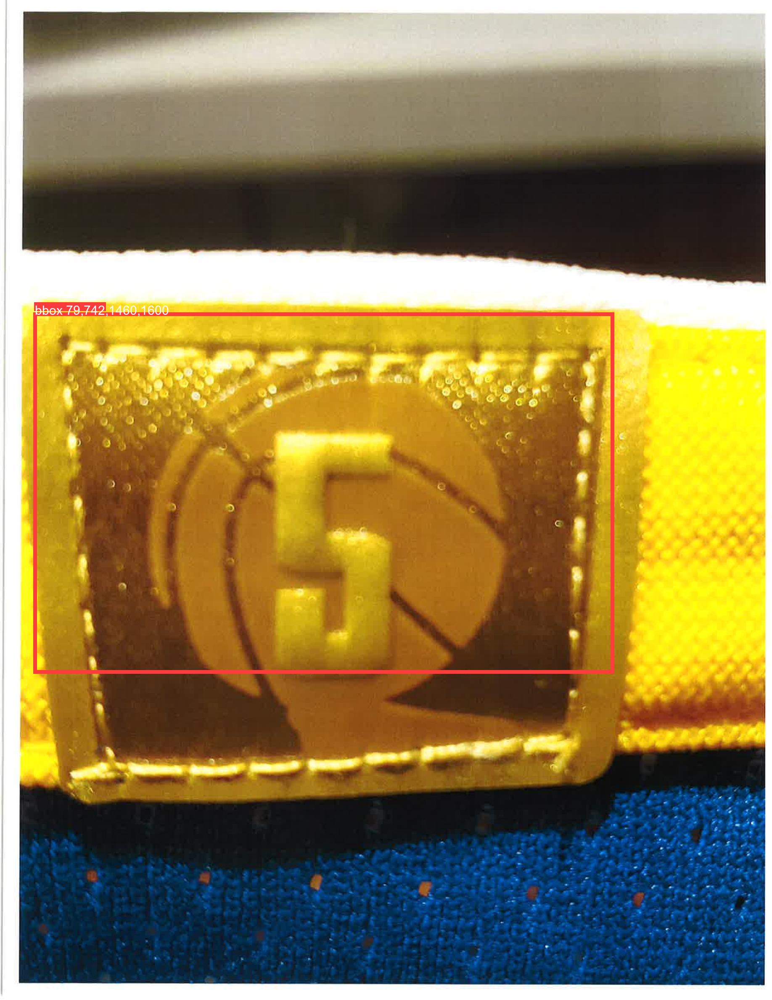 | 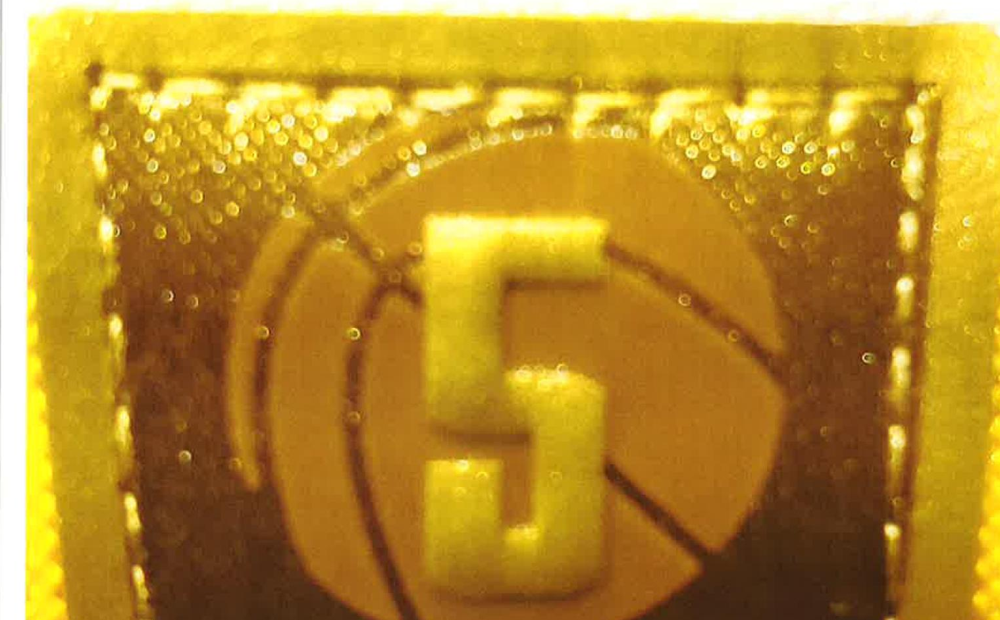 |

---

## 申请号 `97457879`

- **Job**: `d86f61ea499c446c`
- **Model**: `gpt-5.5`  (verify-loop: off, prompt v_?)
- **Confidence**: `0.74`
- **bbox**: `[507, 1541, 607, 1638]`
- **Reason**: A product detail thumbnail shows the registered circular logo as branded decoration on the sweatshirt.
- **Quality**: clarity=0.56, completeness=0.9, isolation=0.8

| 线稿 Logo | 原图 + bbox | 裁剪结果 |
| --- | --- | --- |
| 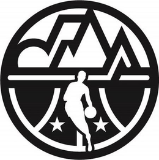 | 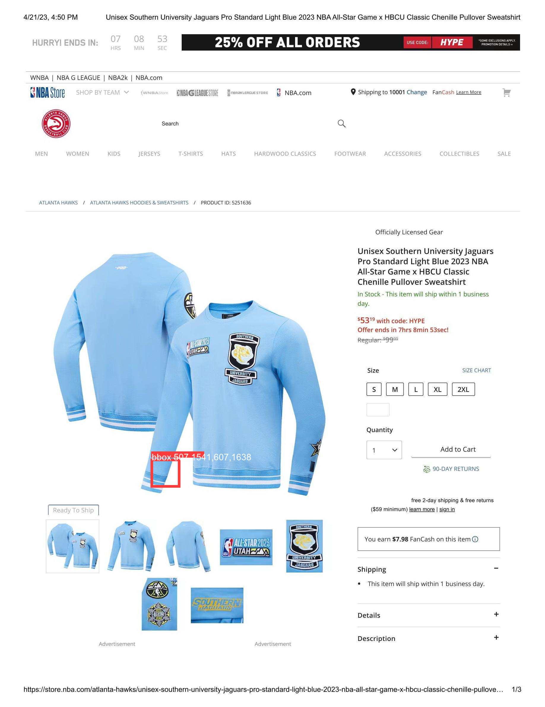 | 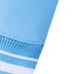 |

---
